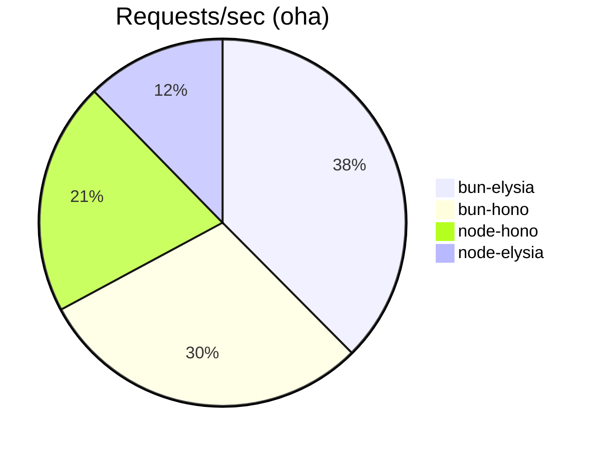
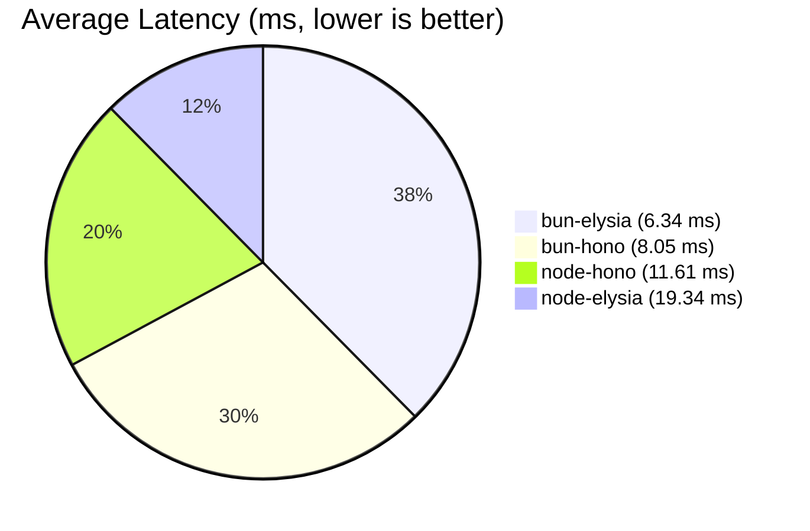
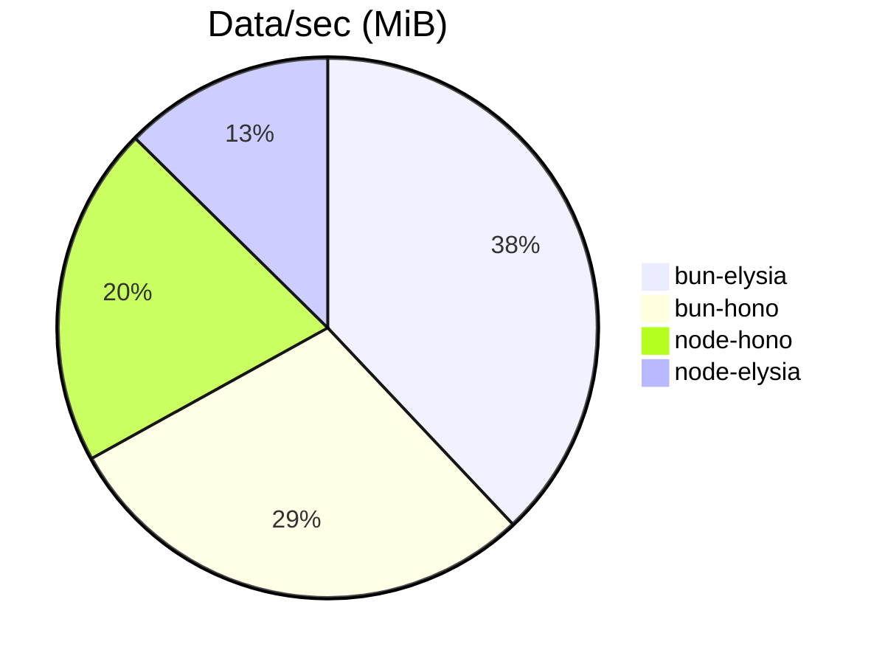
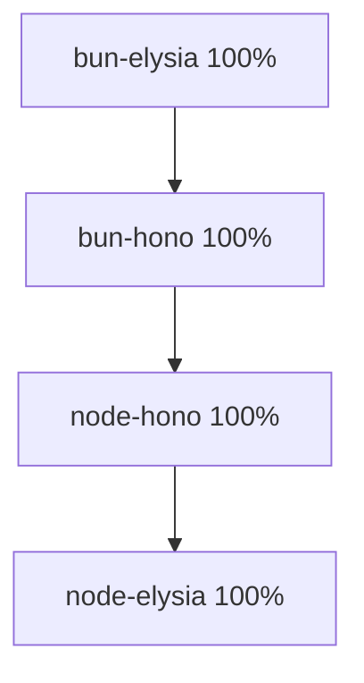

# Web Framework Benchmarks

This repository contains benchmark tests comparing Bun + Hono vs Bun + Elysia and Node.js + Hono vs Node.js + Elysia.

## Project Structure

```
benches/
├── bun-hono/          # Bun runtime + Hono framework (port 3000)
├── bun-elysia/        # Bun runtime + Elysia framework (port 3001)
├── node-hono/         # Node.js runtime + Hono framework (port 3002)
├── node-elysia/       # Node.js runtime + Elysia framework with @elysiajs/node adapter (port 3003)
├── benchmark.sh       # Automated benchmark script
└── README.md          # This file
```

## Setup

All dependencies are managed using Bun package manager and use the latest versions:

- **Hono**: v4.8.12
- **Elysia**: v1.3.8
- **@hono/node-server**: v1.18.1
- **@elysiajs/node**: v1.3.0

## Running Individual Servers

### Bun + Hono (port 3000)
```bash
cd bun-hono
bun run start
```

### Bun + Elysia (port 3001)
```bash
cd bun-elysia
bun run start
```

### Node.js + Hono (port 3002)
```bash
cd node-hono
bun run start  # or node index.js
```

### Node.js + Elysia (port 3003)
```bash
cd node-elysia
bun run start  # or node index.js
```

## API Endpoints

Each server provides the same endpoints:

- `GET /` - Hello message
- `GET /api/test` - Returns timestamp and runtime info (used for benchmarking)
- `POST /api/echo` - Echoes back the request body

## Running Benchmarks

### Prerequisites

Install either `oha` (recommended) or `wrk` for load testing:

#### oha (recommended - faster and more modern)
```bash
# Install via Cargo (Rust package manager)
cargo install oha

# Or download precompiled binary from GitHub releases
# https://github.com/hatoo/oha/releases
```

#### wrk (alternative)
```bash
# Ubuntu/Debian
sudo apt install wrk

# macOS
brew install wrk
```

### Automated Benchmark

Run all benchmarks sequentially:

```bash
./benchmark.sh
```

The script automatically detects which tool is available (prefers oha over wrk) and runs benchmarks for 30 seconds with 400 concurrent connections.

### Manual Benchmark

Start a server manually and run:

#### Using oha
```bash
# Example for bun-hono
cd bun-hono && bun run start &
oha -c 400 -z 30s --no-tui http://localhost:3000/api/test
kill %1
```

#### Using wrk
```bash
# Example for bun-hono
cd bun-hono && bun run start &
wrk -t12 -c400 -d30s http://localhost:3000/api/test
kill %1
```

## Expected Results

The benchmarks will show:
- Requests/sec
- Latency statistics (avg, stdev, max)
- Transfer rate

*Note: Actual results may vary based on hardware, system load, and network conditions.*

## Results

> [!NOTE]
> Ran on a Intel i3 12100, iGPU

<details>

<summary><h3>Using <code>oha</code><h3></summary>

```sh
❯ ./benchmark.sh
🚀 Starting benchmark for all configurations...
=================================================
📊 Using oha for benchmarking

🔥 Testing bun-hono on port 3000
Starting server...
$ bun run index.ts
Started development server: http://localhost:3000
✅ Server is running
Running benchmark for 30 seconds with 400 concurrent connections...
Summary:
  Success rate: 100.00%
  Total:        30005.1704 ms
  Slowest:      55.6873 ms
  Fastest:      2.4059 ms
  Average:      8.0484 ms
  Requests/sec: 49670.1729

  Total data:   88.10 MiB
  Size/request: 62 B
  Size/sec:     2.94 MiB

Response time histogram:
   2.406 ms [1]      |
   7.734 ms [918463] |■■■■■■■■■■■■■■■■■■■■■■■■■■■■■■■■
  13.062 ms [479027] |■■■■■■■■■■■■■■■■
  18.390 ms [63294]  |■■
  23.718 ms [16095]  |
  29.047 ms [9853]   |
  34.375 ms [2509]   |
  39.703 ms [264]    |
  45.031 ms [176]    |
  50.359 ms [147]    |
  55.687 ms [135]    |

Response time distribution:
  10.00% in 5.5684 ms
  25.00% in 6.1976 ms
  50.00% in 7.1556 ms
  75.00% in 8.7047 ms
  90.00% in 11.3247 ms
  95.00% in 13.8692 ms
  99.00% in 22.7233 ms
  99.90% in 31.2038 ms
  99.99% in 49.5872 ms


Details (average, fastest, slowest):
  DNS+dialup:   0.0470 ms, 0.0092 ms, 19.8806 ms
  DNS-lookup:   0.0026 ms, 0.0009 ms, 1.2069 ms

Status code distribution:
  [200] 1489964 responses

Error distribution:
  [398] aborted due to deadline
error: script "start" was terminated by signal SIGTERM (Polite quit request)

🔥 Testing bun-elysia on port 3001
Starting server...
$ bun run index.ts
🦊 Elysia is running at http://localhost:3001
✅ Server is running
Running benchmark for 30 seconds with 400 concurrent connections...
Summary:
  Success rate: 100.00%
  Total:        30004.4303 ms
  Slowest:      54.5418 ms
  Fastest:      2.5457 ms
  Average:      6.3427 ms
  Requests/sec: 63026.1925

  Total data:   115.40 MiB
  Size/request: 64 B
  Size/sec:     3.85 MiB

Response time histogram:
   2.546 ms [1]       |
   7.745 ms [1560581] |■■■■■■■■■■■■■■■■■■■■■■■■■■■■■■■■
  12.945 ms [272296]  |■■■■■
  18.145 ms [45951]   |
  23.344 ms [8751]    |
  28.544 ms [2223]    |
  33.743 ms [138]     |
  38.943 ms [131]     |
  44.143 ms [359]     |
  49.342 ms [188]     |
  54.542 ms [46]      |

Response time distribution:
  10.00% in 4.2858 ms
  25.00% in 4.7808 ms
  50.00% in 5.5836 ms
  75.00% in 6.9127 ms
  90.00% in 9.4190 ms
  95.00% in 11.5251 ms
  99.00% in 16.1497 ms
  99.90% in 25.3949 ms
  99.99% in 45.2572 ms


Details (average, fastest, slowest):
  DNS+dialup:   0.0533 ms, 0.0090 ms, 41.9475 ms
  DNS-lookup:   0.0025 ms, 0.0009 ms, 1.0462 ms

Status code distribution:
  [200] 1890665 responses

Error distribution:
  [400] aborted due to deadline
error: script "start" was terminated by signal SIGTERM (Polite quit request)

🔥 Testing node-hono on port 3002
Starting server...
Server is running on http://localhost:3002
✅ Server is running
Running benchmark for 30 seconds with 400 concurrent connections...
Summary:
  Success rate: 100.00%
  Total:        30003.6179 ms
  Slowest:      150.5411 ms
  Fastest:      4.0480 ms
  Average:      11.6070 ms
  Requests/sec: 34452.7118

  Total data:   62.08 MiB
  Size/request: 63 B
  Size/sec:     2.07 MiB

Response time histogram:
    4.048 ms [1]       |
   18.697 ms [1017048] |■■■■■■■■■■■■■■■■■■■■■■■■■■■■■■■■
   33.347 ms [8870]    |
   47.996 ms [4768]    |
   62.645 ms [2139]    |
   77.295 ms [46]      |
   91.944 ms [49]      |
  106.593 ms [40]      |
  121.242 ms [54]      |
  135.892 ms [90]      |
  150.541 ms [201]     |

Response time distribution:
  10.00% in 10.6807 ms
  25.00% in 10.7784 ms
  50.00% in 10.9119 ms
  75.00% in 11.1522 ms
  90.00% in 12.8787 ms
  95.00% in 13.4274 ms
  99.00% in 25.5018 ms
  99.90% in 53.9379 ms
  99.99% in 142.6594 ms


Details (average, fastest, slowest):
  DNS+dialup:   0.0203 ms, 0.0086 ms, 21.2690 ms
  DNS-lookup:   0.0017 ms, 0.0009 ms, 0.2509 ms

Status code distribution:
  [200] 1033306 responses

Error distribution:
  [400] aborted due to deadline

🔥 Testing node-elysia on port 3003
Starting server...
🦊 Elysia is running at http://localhost:3003
✅ Server is running
Running benchmark for 30 seconds with 400 concurrent connections...
Summary:
  Success rate: 100.00%
  Total:        30005.4098 ms
  Slowest:      156.5522 ms
  Fastest:      16.2554 ms
  Average:      19.3358 ms
  Requests/sec: 20683.6036

  Total data:   38.45 MiB
  Size/request: 65 B
  Size/sec:     1.28 MiB

Response time histogram:
   16.255 ms [1]      |
   30.285 ms [605772] |■■■■■■■■■■■■■■■■■■■■■■■■■■■■■■■■
   44.315 ms [11206]  |
   58.344 ms [1033]   |
   72.374 ms [403]    |
   86.404 ms [527]    |
  100.433 ms [484]    |
  114.463 ms [458]    |
  128.493 ms [79]     |
  142.523 ms [117]    |
  156.552 ms [140]    |

Response time distribution:
  10.00% in 16.6569 ms
  25.00% in 16.8455 ms
  50.00% in 17.3277 ms
  75.00% in 20.4062 ms
  90.00% in 24.2405 ms
  95.00% in 26.6451 ms
  99.00% in 35.7219 ms
  99.90% in 104.5979 ms
  99.99% in 149.8813 ms


Details (average, fastest, slowest):
  DNS+dialup:   0.0201 ms, 0.0087 ms, 17.5559 ms
  DNS-lookup:   0.0019 ms, 0.0010 ms, 0.3065 ms

Status code distribution:
  [200] 620220 responses

Error distribution:
  [400] aborted due to deadline

🎉 All benchmarks completed!
```

</details>

<details>
<summary><h3>Using <code>wrk</code></summary>

❯ ./benchmark.sh
🚀 Starting benchmark for all configurations...
=================================================

🔥 Testing bun-hono on port 3000
Starting server...
$ bun run index.ts
Started development server: http://localhost:3000
✅ Server is running
Running benchmark for 30 seconds with 12 threads and 400 connections...
Running 30s test @ http://localhost:3000/api/test
  12 threads and 400 connections
  Thread Stats   Avg      Stdev     Max   +/- Stdev
    Latency     5.63ms    3.88ms  62.01ms   83.32%
    Req/Sec     6.34k     3.42k   13.25k    54.20%
  2273786 requests in 30.10s, 368.64MB read
Requests/sec:  75546.73
Transfer/sec:     12.25MB
error: script "start" was terminated by signal SIGTERM (Polite quit request)

🔥 Testing bun-elysia on port 3001
Starting server...
$ bun run index.ts
🦊 Elysia is running at http://localhost:3001
✅ Server is running
Running benchmark for 30 seconds with 12 threads and 400 connections...
Running 30s test @ http://localhost:3001/api/test
  12 threads and 400 connections
  Thread Stats   Avg      Stdev     Max   +/- Stdev
    Latency     3.99ms    2.82ms  40.32ms   82.10%
    Req/Sec     8.98k     5.17k   19.28k    58.96%
  3220210 requests in 30.10s, 528.22MB read
Requests/sec: 106993.21
Transfer/sec:     17.55MB
error: script "start" was terminated by signal SIGTERM (Polite quit request)

🔥 Testing node-hono on port 3002
Starting server...
Server is running on http://localhost:3002
✅ Server is running
Running benchmark for 30 seconds with 12 threads and 400 connections...
Running 30s test @ http://localhost:3002/api/test
  12 threads and 400 connections
  Thread Stats   Avg      Stdev     Max   +/- Stdev
    Latency    13.04ms   66.15ms   1.28s    98.40%
    Req/Sec     5.74k     1.34k   33.20k    86.18%
  2032269 requests in 30.10s, 422.51MB read
Requests/sec:  67519.85
Transfer/sec:     14.04MB

🔥 Testing node-elysia on port 3003
Starting server...
🦊 Elysia is running at http://localhost:3003
✅ Server is running
Running benchmark for 30 seconds with 12 threads and 400 connections...
Running 30s test @ http://localhost:3003/api/test
  12 threads and 400 connections
  Thread Stats   Avg      Stdev     Max   +/- Stdev
    Latency    23.95ms  111.11ms   2.00s    98.11%
    Req/Sec     3.06k   587.94    13.88k    90.54%
  1076017 requests in 30.10s, 225.76MB read
  Socket errors: connect 0, read 0, write 0, timeout 49
Requests/sec:  35747.86
Transfer/sec:      7.50MB

🎉 All benchmarks completed!

</details>

## Benchmark Results Visualization

### Requests per Second



---

### Average Latency (ms)
*(Lower is better)*


*(Proportional slices to 1/latency, showing "relative speed")*

---

### Data Transferred per Second (MiB)



---

### Success Rate (All 100%)



---

#### Response Time Distribution (Percentile Table)

| Framework      | 50% (ms) | 75% (ms) | 90% (ms) | 95% (ms) | 99% (ms) |
|----------------|----------|----------|----------|----------|----------|
| bun-elysia     | 5.58     | 6.91     | 9.42     | 11.53    | 16.15    |
| bun-hono       | 7.16     | 8.70     | 11.32    | 13.87    | 22.72    |
| node-hono      | 10.91    | 11.15    | 12.88    | 13.43    | 25.50    |
| node-elysia    | 17.33    | 20.41    | 24.24    | 26.65    | 35.72    |

---

### Key Takeaways

- **bun-elysia** leads in throughput, latency, and data transfer.
- **bun-hono** is the second best in all categories.
- **Node.js** stacks are significantly slower, with Elysia faring worst.
- All frameworks achieved 100% success rate.
